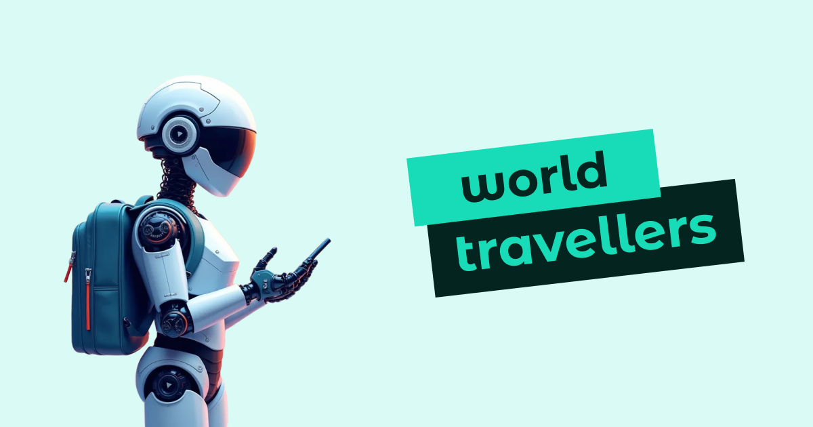

<p align="center"></p>

<h3 align="center">World Travellers</h3>
<p align="center">"Find the Perfect Travel Insurance with World Travellers CareAdvisor"</p>
<p align="center"><a href="https://world-travellers.vercel.app/">https://world-travellers.vercel.app/</a></p>

## Overview

This is a german health care advisor chatbot prototype, powered by openAI API. There are three different insurance plans available, on which all the information is based.

## Features

- 'Tariff finder' to find the best matching insurance plan
- 'Common questions' to ask anything about the three plans
- iPhone wrapper to demonstrate this mobile-only app on desktops

## Used Tech Stack

- Next.JS 14
- TypeScript for typesafe developing
- TailwindCSS for styling
- OpenAI Assistant API for chatbot logic
- Jest and React-Testing-Library for tests
- Sonner for toasts
- Zustand for state management
- React-remark for markdown conversion
- Tabler for icons
- React-spinners for loading indicators

## Getting Started

### Installation

`npm install`

### Create .env.local File

```
OPENAI_API_KEY = ''
OPENAI_ASSISTANT_ID=''
```

### Run Dev Environment

`npm run dev`

<a href="http://localhost:3000">http://localhost:3000</a>

## About

All insurance plans and designs were crafted by me. All information is fictional. Title image is generated with Flux.

I'm looking forward to start exciting projects with you as a 100% remote developer.

You can learn more about me and my tech stack on my GitHub or portfolio page."
